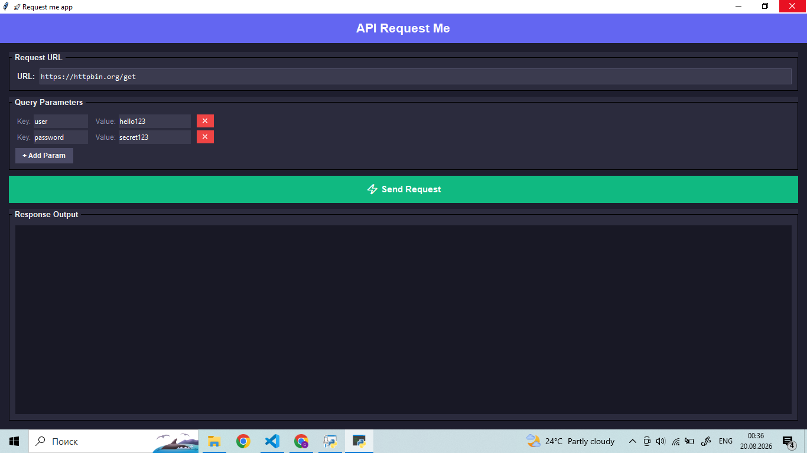

# 🚀 API Request Me

### A sleek, user-friendly desktop companion for testing APIs, managing query parameters, and inspecting responses on the fly! ⚡

---

## ✨ Features

* 🌐 **Custom URL Input** — Easily plug in any endpoint you want to test and target your APIs instantly.
* 🧩 **Dynamic Query Parameters** — Add, configure, and remove key-value pairs effortlessly with intuitive controls (`+ Add Param`).
* ⚡ **Lightning Fast Execution** — A clean, prominent "Send Request" trigger to fire off your API calls seamlessly.
* 📊 **Real-Time Response Viewer** — Dedicated dark-themed output workspace to inspect server data and payloads cleanly.

---

## 📸 Preview

  

---

## 🕹️ How to Use

1. **Set the Target:** Type or paste your destination endpoint URL into the **Request URL** field.
2. **Build Query Strings:** Click the **`+ Add Param`** button to create as many key-value pairs as your request demands.
3. **Fire Request:** Hit the big green **Send Request** button to dispatch your call.
4. **Inspect Output:** View the incoming response details directly inside the **Response Output** block.

---

## 💖 Contributing

Contributions, feature requests, and bug reports are always welcome! Feel free to fork the repository and open a pull request.

Built with passion for developers and testers alike. 🚀

